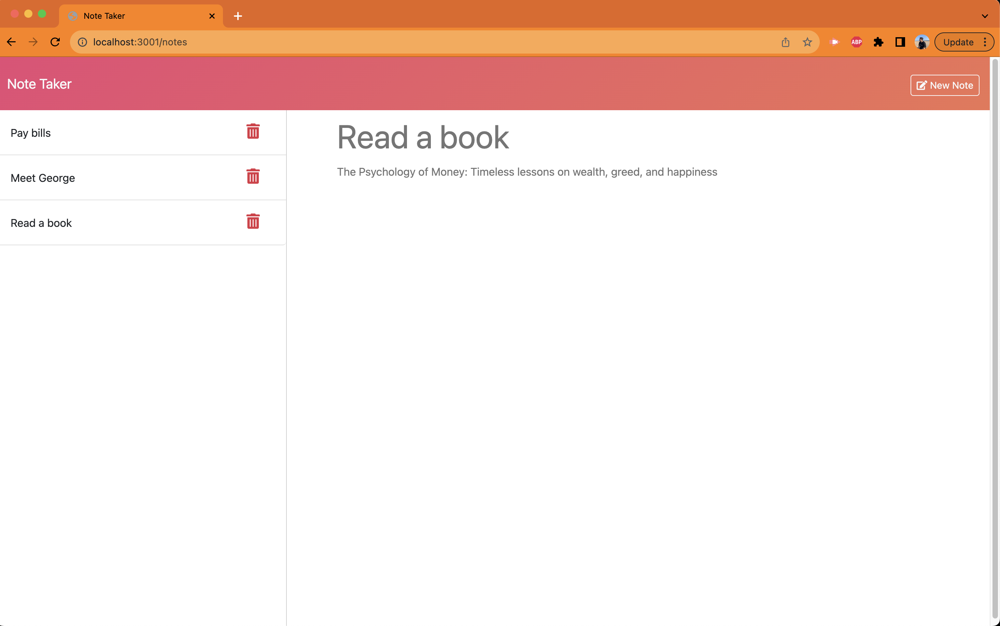

# Note-Taking Application

This is a simple note-taking application designed to cater to the needs of small business owners who want to write and save notes for organizing their thoughts and keeping track of tasks. This README file will guide you through the application's features and usage.

## Table of Contents

- [Features](#features)
- [Installation](#installation)
- [Usage](#usage)
- [License](#license)
- [ScreenShot](#screenShots)
---

## Features

### 1. Landing Page
- When you open the Note Taker, you are presented with a landing page that includes a link to the notes page.

### 2. Notes Page
- Clicking on the link to the notes page takes you to a page with the following features:
    - **Existing Notes**: A left-hand column displays existing notes.
    - **New Note Fields**: A right-hand column includes empty fields for entering a new note title and the note's text.

### 3. Creating a New Note
- To create a new note, follow these steps:
    - Enter a new note title and the note's text in the right-hand column.
    - After entering the content, a "Save Note" button and a "Clear Form" button will appear in the navigation at the top of the page.

### 4. Saving a Note
- To save the new note, simply click on the "Save Note" button.
    - The new note you've entered will be saved and added to the left-hand column with the other existing notes.
    - The "Save Note" and "Clear Form" buttons in the navigation will disappear.

### 5. Viewing an Existing Note
- If you wish to view an existing note, click on the note's title in the left-hand column.
    - The selected note will appear in the right-hand column.
    - A "New Note" button will appear in the navigation at the top of the page, allowing you to create another new note.

### 6. Creating Another New Note
- To create another new note after viewing an existing one, click on the "New Note" button in the navigation.
    - Empty fields for entering a new note title and text will reappear in the right-hand column.
    - The "New Note" button in the navigation will disappear again.

---

## Installation

To use this note-taking application, you don't need to install anything on your local machine. Simply visit the provided URL in your web browser, and you can start using the application immediately.

If live deployment link not provided/working follow these steps: 

1. Clone the Repository 
2. Open Server.js in intergrated terminal 
3. Install node package manager by entering 'npm install'
4. Then enter nodemon server.js 
5. You will receive a message with a localhost port with the working note taker.
6. Open the provided localhost port and use the note taker in your local device!

---

## Usage

1. **Access the Application**:
   - Open your web browser.
   - Enter the URL provided to access the Note Taker application.

2. **Create a New Note**:
   - Click on the link to the notes page on the landing page.
   - In the right-hand column, enter a new note title and the note's text.
   - Click the "Save Note" button to save the note.

3. **View Existing Notes**:
   - On the notes page, the left-hand column lists all existing notes.
   - Click on an existing note's title to view its content in the right-hand column.

4. **Create Another New Note**:
   - After viewing an existing note, click the "New Note" button in the navigation.
   - Enter new note details in the right-hand column and click "Save Note."

---

## Screenshots

---

## License

This project is licensed under the [MIT License](LICENSE), which means you are free to use, modify, and distribute the code as long as you provide appropriate attribution and adhere to the terms of the license.

---
